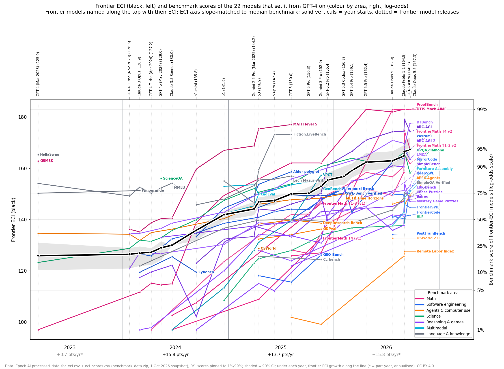

# Frontier ECI and the benchmark scores behind it

Epoch AI's [Capabilities Index](https://epoch.ai/eci) (ECI) fits one capability number per model from ~60 benchmarks, using

    score = sigmoid(slope_b × (ECI_model − difficulty_b))

so on a log-odds scale every benchmark should rise linearly with ECI. These charts plot that directly: the benchmark scores of the models that set the frontier ECI, in log-odds, with frontier ECI overlaid on a second axis.



- **Interactive version:** https://tecunningham.github.io/eci-benchmark-logodds/ (source [`index.html`](index.html)). Choose a lab to see that lab's own frontier (running best ECI among its models), with the overall frontier dashed for comparison. Link straight to a lab with `#lab=<name>`, e.g. `#lab=OpenAI`.
- **Left axis:** each benchmark's score for the models that set a new frontier ECI, as log-odds, labelled in percent. Colour is the benchmark's area.
- **Right axis:** frontier ECI (running maximum by release date) with its 90% interval. The axis is scaled so a benchmark with the median fitted slope (0.107 logits per ECI point) runs parallel to the ECI line.
- **Top:** the 22 record-setting models from GPT-4 (Mar 2023) on, with their ECI.

## Data

`data/epoch/` holds three files from Epoch's [`benchmark_data.zip`](https://epoch.ai/data/benchmark_data.zip), snapshot of 1 Oct 2026:

| File | What it is |
|---|---|
| `processed_data_for_eci.csv` | The exact table the ECI is fit on: one row per model group × benchmark |
| `eci_scores.csv` | Published ECI per model, with 90% intervals |
| `edi_scores.csv` | Fitted benchmark difficulty and slope |

Scores are already floor- and ceiling-adjusted. Each is `(raw − random-guess baseline) / (attainable ceiling − baseline)`, clipped to [0, 1], taking the best version within each model group. This was checked: all 2,844 rows reproduce exactly from the raw score files and `benchmark_metadata.csv` in the zip.

## Choices

- **Start date.** Models released before GPT-4 (14 Mar 2023) are left out of the chart. They still affect the ECI values, since Epoch fits all models jointly.
- **Frontier.** Running maximum of ECI by release date. When several models share a date, only the highest counts.
- **Labs.** A model's lab is the first organisation Epoch lists for it ("Google" merged into "Google DeepMind", "Microsoft Research" into "Microsoft"; the 17 models with no organisation are assigned by model family where obvious, else "Other"). Labs with at least five models since GPT-4 appear in the interactive page's lab menu. ECIs come from Epoch's joint fit over all labs, so a lab's frontier is comparable with the overall one.
- **Zeros and ones.** Scores of exactly 0 or 1 are pinned to 1% and 99% so their log-odds are finite.
- **Areas.** The primary (first) domain tag on [epoch.ai/eci](https://epoch.ai/eci), grouped into seven areas (see `scripts/areas.py`). Seven benchmarks have no tag there and were assigned by hand: METR Time Horizons and DeepResearch Bench (agents), LMCA (reasoning), Lech Mazur Writing (language), GeoBench (multimodal), and the two FrontierMath v1 sets (math).

## Rebuild

```bash
pip install pandas numpy matplotlib
cd scripts
python build_data.py     # data/epoch/*.csv -> data/frontier_all.json, data/eci_data.json
python make_figure.py    # -> figures/eci_frontier_all.png
python build_page.py     # page_template.html + eci_data.json -> ../index.html
```

The interactive page embeds `eci_data.json` (every model and score since GPT-4, tagged by lab) and computes each lab's frontier in the browser. It uses Plotly from jsDelivr and falls back to the static PNG if that fails to load.

## Credit

Data: Epoch AI, [Epoch Capabilities Index](https://epoch.ai/eci), CC BY 4.0. Method: [A Rosetta Stone for AI Benchmarks](https://arxiv.org/abs/2512.00193) and [eci-public](https://github.com/epoch-research/eci-public).
